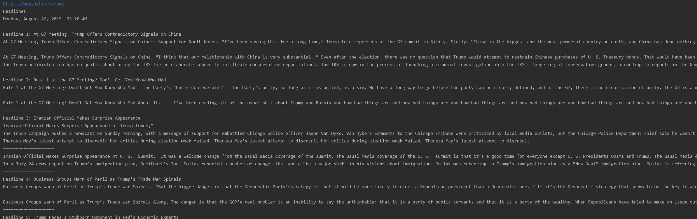

In this part I will show you how to make a *credible* Fake News Generator.



You'll need some knowledge about **webscraping**, the rest is pretty straightforward.

We'll scrape the headlines of the NY Times and use those headlines on our trained and finetuned model to generate text.

```
pip install gpt-2-simple
```

Open Powershell and type ```python```
```
>>>import gpt_2_simple as gpt2
>>>gpt2.download_gpt2(model_name="355M")
```
It should start downloading...
```PowerShell
Fetching checkpoint: 1.05Mit [00:00, 1.05Git/s]
Fetching encoder.json: 1.05Mit [00:00, 6.57Mit/s]
Fetching hparams.json: 1.05Mit [00:00, 1.05Git/s]
Fetching model.ckpt.data-00000-of-00001: 1.42Git [02:38, 24.6Mit/s]
Fetching model.ckpt.index: 1.05Mit [00:00, 526Mit/s]
Fetching model.ckpt.meta: 1.05Mit [00:00, 6.26Mit/s]
Fetching vocab.bpe: 1.05Mit [00:00, 8.34Mit/s]
```
exit python with ```quit()```

Now we'll use the trained model finetuned to news-articles, copy your model (or dowload mine and extract it) to **checkpoint/news/**

Using the script below, we will load the checkpoint, scrape the headlines of the NY Times and generate the Fake News based on the headlines.
```
import requests
from bs4 import BeautifulSoup
import json
import datetime
import gpt_2_simple as gpt2

sess = gpt2.start_tf_sess()
gpt2.load_gpt2(sess, run_name='news')

url = "https://www.nytimes.com/"
r = requests.get(url)
now = datetime.datetime.now()
now = now.strftime('%A, %B %d, %Y  %I:%M %p')

r_html = r.text
soup = BeautifulSoup(r_html, "html.parser")

scripts = soup.find_all('script')
for script in scripts:
    if 'preloadedData' in script.text:
        jsonStr = script.text
        jsonStr = jsonStr.split('=', 1)[1].strip()
        jsonStr = jsonStr.rsplit(';', 1)[0]
        jsonObj = json.loads(jsonStr)


print ('%s\nHeadlines\n%s\n' %(url, now))
count = 1
for ele, v in jsonObj['initialState'].items():
    try:
        if v['headline'] and v['__typename'] == 'PromotionalProperties':
            print('Headline %s: %s...' %(count, v['headline']))
            print("="*80)
            gpt2.generate(sess,
                          length=200,
                          temperature=0.7,
                          prefix=v['headline'],
                          nsamples=1,
                          batch_size=1,
                          run_name='news'
                          )
            count += 1
            print("=" * 80)
    except:
        continue
```
